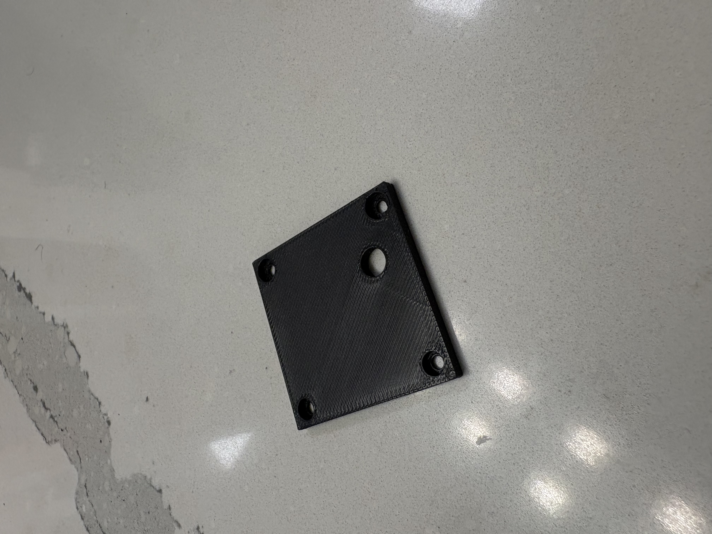
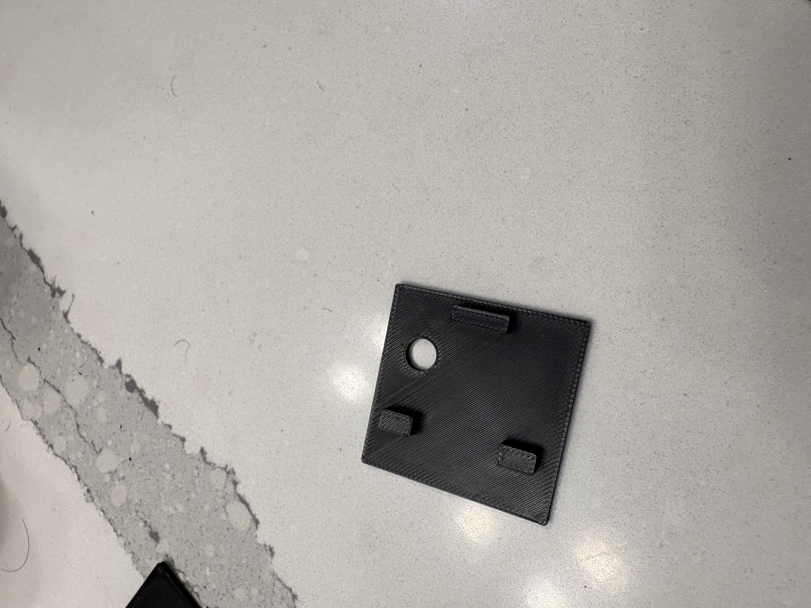
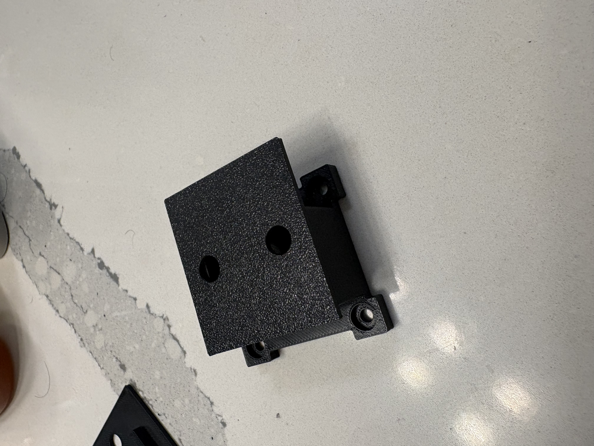

# Engineering & Physics Portfolio

Welcome to my project portfolio! This repository showcases custom CAD hardware, optical setups, and technical engineering projects developed for research and practical application.

## 📋 Table of Contents
1. [Quantum Optics Lab Stage Mounts](#1-quantum-optics-lab-stage-mounts)
2. [Project 2: [Insert Title]](#2-project-2-insert-title)
3. [Project 3: [Insert Title]](#3-project-3-insert-title)

---

# 1. Quantum Optics Lab Stage Mounts
Personal portfolio and technical projects for the MTSU Quantum Optics Lab, featuring custom CAD hardware, mechanical frame layouts, and an AI-assisted instrument control system.

### 1.1 Project Task & Engineering Challenge
* **Objective:** Securely mount specialized fiber holders onto translational stages to draw optical fiber under controlled tension over a hydrogen flame.
* **Constraints:** Commercial stage hardware lacked the proper clearance, vertical offset, and stability required for precise repeatable results.
* **Goal:** Design, iterate, and deploy a custom, high-rigidity stage mount to optimize precision and repeatability.

---

### 1.2 Design Logic & Prototyping Approach
* **Modular Two-Part System:** Split the mount into a **Base Plate** (interfaces directly with the stage) and a **Top Bracket** (clamps the fiber fixture) for fast alignment adjustments and component swapping.
* **Universal Dual-Hole Pattern:** Integrated symmetric mounting holes into the base plate design. This allows a single printed part to be deployed interchangeably on either the left or right side of the stage setup, eliminating the need to design and manage separate left- and right-handed models.
* **Prototyping Strategy:** Utilized 3D-printed PETG/PLA for rapid dimensional validation and clearance testing before final deployment.
* **Thermal Considerations:** Designed clearance offsets relative to the flame source to prevent localized heating or material sagging during active fiber drawing runs.

---

### 1.3 Iteration History & Development

#### Phase 1: Early Prototypes & Initial Fit Check
Initial spatial checks to test stage mounting hole spacing and overall base plate geometry.

| Base Plate (V1) | Stage Fit Check Assembly |
| :---: | :---: |
|  |  |
| *Initial base mounting plate* | *Assembled fit-check on stage* |

---

#### Phase 2: Top Bracket & Binding Clearance Analysis
Evaluating upper bracket geometry and identifying translation binding issues.

| Top Bracket (V1) | Failed Fit Check (Side View) |
| :---: | :---: |
|  |  |
| *First top bracket geometry* | *Side view clearance breakdown* |

* **Key Finding:** Initial V1 geometry created binding along the translation vector. Adjustments were made to side offsets and hole counterbores for subsequent revisions.

---

#### Phase 3: Refined Base Plate Geometry & Alignment Fit
Upgraded base plate design featuring reinforced side walls, corrected stage hole tolerances, and physical fit verification.

| Base Plate (V2) | Alignment Verification |
| :---: | :---: |
|  |  |
| *Reinforced base plate V2* | *Alignment verification and clearance test* |

---

#### Phase 4: Final Production Setup
Final assembly integrated and active in the laboratory fiber tapering rig.

| Final Deployment | Overhead View | Mount Interface Detail |
| :---: | :---: | :---: |
|  |  |  |
| *In operation over hydrogen flame* | *Overhead optical alignment check* | *Stage mounting interface* |

---

### 1.4 3D Printable Models (STL)

Click any link below to view or rotate the 3D models directly on GitHub:

* **[Final Design](Final_Design.stl)**
* **[Full Base V2](Full_Base_V2.stl)**
* **[Top V2](Top_V2.stl)**
* **[Top V1](Top_V1.stl)**
* **[Full Base V1](Full_Base_V1.stl)**
* **[Base V1](Base_v1.stl)**
* **[Prototype 2](Prototype_number_2.stl)**
* **[Prototype 1](Prototype_number_1.stl)**

---

### 1.5 Summary & Key Results
* **Alignment & Versatility:** Successfully eliminated stage binding with a dual-hole universal base plate that mounts on either side of the setup.
* **Rigidity:** Modular clamp system holds fiber under tension without mechanical drift.
* **Cost & Time:** Iterated through spatial fit checks via 3D printing in hours, bypassing expensive trial-and-error machining.

---

# 2. Integrated Lab Control & Vision System GUI
A full-stack, web-based instrument control system designed for the MTSU Quantum Optics Lab. The application consolidates dual-axis motor stage control, live microscope camera streaming, and real-time optical fiber measurement tools into a single unified interface.

---

### 2.1 Hardware Architecture & System Goals

* **Primary Objective:** Unify separate hardware peripherals (motor controllers and high-resolution camera feed) into one cohesive, browser-accessible dashboard.
* **Core Functionality:** Enable real-time motor stage translation, synchronized sequence routines, live video feed observation, image capture, and calibrated spatial measurements in micrometers ($\mu\text{m}$).

| System Goals | Integrated Hardware Peripherals |
| :--- | :--- |
| • **Simplified Motor Control:** Centralized axis position monitoring, homing, and safety stops. | • **2x Thorlabs Motor Controllers** (KDC101 Servo Controllers) |
| • **Unified Interface:** Integrated live camera streaming alongside dual-axis translation controls. | • **2x Thorlabs Translation Stages** |
| • **Preset Camera Control:** Adjustable exposure, gain, auto-scaling, and resolution controls. | • **1x Pixelink Industrial Camera** |
| • **In-Situ Measurement:** Direct pixel-to-micrometer dimensional measurement overlay. | • **1x Optical Microscope Assembly** |

---

### 2.2 System Architecture & Logic Map

The application follows a full-stack architecture with an asynchronous HTTP API layer linking the client dashboard to hardware-driver Python scripts.

| System Logic & Software Flow |
| :---: |
|  |
| *Frontend-to-backend communication architecture via HTTP GET/POST requests* |

#### Technical Stack Breakdown:
* **Front End:** HTML5, CSS3, JavaScript (Fetch API for asynchronous `GET`/`POST` requests, responsive canvas overlays for measurement calculations).
* **Back End:** Python (RESTful API hosting via `Main.py`), controlling physical devices through submodules (`Motor_controller.py` and `Camera_controller.py`).
* **Communication Protocols:** JSON payload response handling for real-time motor telemetry (positioning, idle status) and live video streaming.

---

### 2.3 System Layout & Hardware Deployment

The entire system runs on a dedicated laboratory laptop, providing direct USB interface lines to all optomechanical components mounted on the optical table.

| Hardware Connection Schematic | Physical Laboratory Setup |
| :---: | :---: |
|  |  |
| *Hardware topology and signal flow* | *Optomechanical bench deployment and controller routing* |

---

### 2.4 User Interface & Operational Control

#### 1. Main Control Dashboard (`index.html`)
Consolidates motor operations and vision streaming into a single view for active experimentation.

| Dashboard Overview | Key Dashboard Features |
| :---: | :--- |
|  | • **Dual Motor Monitoring:** Live position readout ($mm$) and status tracking (Idle / Active). • **Independent Axis Actions:** Homing, pausing, resuming, and stopping per motor. • **Global Safety Controls:** One-click `Pause Both`, `Resume Both`, and emergency `Stop Both`. • **Automated Sequences:** Dropdown selector to execute synchronized multi-axis movement routines. • **Quick Capture:** Instant single-frame optical capture directly from the main view. |

---

# 2. Integrated Lab Control & Vision System GUI
A full-stack, web-based instrument control system designed for the MTSU Quantum Optics Lab. The application consolidates dual-axis motor stage control, live microscope camera streaming, and real-time optical fiber measurement tools into a single unified interface.

---

### 2.1 Hardware Architecture & System Goals

* **Primary Objective:** Unify separate hardware peripherals (motor controllers and high-resolution camera feed) into one cohesive, browser-accessible dashboard.
* **Core Functionality:** Enable real-time motor stage translation, synchronized sequence routines, live video feed observation, image capture, and calibrated spatial measurements in micrometers ($\mu\text{m}$).

| System Goals | Integrated Hardware Peripherals |
| :--- | :--- |
| • **Simplified Motor Control:** Centralized axis position monitoring, homing, and safety stops. | • **2x Thorlabs Motor Controllers** (KDC101 Servo Controllers) |
| • **Unified Interface:** Integrated live camera streaming alongside dual-axis translation controls. | • **2x Thorlabs Translation Stages** |
| • **Preset Camera Control:** Adjustable exposure, gain, auto-scaling, and resolution controls. | • **1x Pixelink Industrial Camera** |
| • **In-Situ Measurement:** Direct pixel-to-micrometer dimensional measurement overlay. | • **1x Optical Microscope Assembly** |

---

### 2.2 System Architecture & Logic Map

The application follows a full-stack architecture with an asynchronous HTTP API layer linking the client dashboard to hardware-driver Python scripts.

| System Logic & Software Flow |
| :---: |
|  |
| *Frontend-to-backend communication architecture via HTTP GET/POST requests* |

#### Technical Stack Breakdown:
* **Front End:** HTML5, CSS3, JavaScript (Fetch API for asynchronous `GET`/`POST` requests, responsive canvas overlays for measurement calculations).
* **Back End:** Python (RESTful API hosting via `Main.py`), controlling physical devices through submodules (`Motor_controller.py` and `Camera_controller.py`).
* **Communication Protocols:** JSON payload response handling for real-time motor telemetry (positioning, idle status) and live video streaming.

---

### 2.3 System Layout & Hardware Deployment

The entire system runs on a dedicated laboratory laptop, providing direct USB interface lines to all optomechanical components mounted on the optical table.

| Presentation View | Physical Laboratory Setup |
| :---: | :---: |
|  |  |

---

### 2.4 User Interface & Operational Control

#### 1. Main Control Dashboard (`index.html`)
Consolidates motor operations and vision streaming into a single view for active experimentation.

| Dashboard Overview | Key Dashboard Features |
| :---: | :--- |
|  | • **Dual Motor Monitoring:** Live position readout ($mm$) and status tracking (Idle / Active). • **Independent Axis Actions:** Homing, pausing, resuming, and stopping per motor. • **Global Safety Controls:** One-click `Pause Both`, `Resume Both`, and emergency `Stop Both`. • **Automated Sequences:** Dropdown selector to execute synchronized multi-axis movement routines. • **Quick Capture:** Instant single-frame optical capture directly from the main view. |

---

#### 2. Detailed Motor Control View (`motors.html`)
Dedicated view for granular dual-axis stage configuration, step control, and sequence selection.

| Motor Control Interface | Key Capabilities |
| :---: | :--- |
|  | • **Axis Specific Readouts:** Individual telemetry windows for Stage 1 and Stage 2. • **Manual & Step Moves:** Direct step-size configuration for precision alignment. • **Independent Axis Safety:** Individual Home, Pause, Resume, and Stop toggles per motor driver. • **Routine Automation:** Direct access to automated drawing and translation scripts. |

---

#### 3. Specialized Camera & Dimensional Measurement View (`camera.html`)
Dedicated view for fine alignment, sensor parameter tuning, and in-situ micro-scale measurement.

| Camera & Measurement Suite | Features & Capabilities |
| :---: | :--- |
|  | • **Camera Parameter Tuning:** Manual entry for Exposure ($ms$) and Gain, alongside one-click Auto-Scale. • **Resolution Control:** Selectable aspect ratios up to $1920 \times 1080$. • **Micrometer Calibration Overlay:** Interactive line-drawing tool converts pixel distance ($px$) directly to micro-scale length ($\mu\text{m}$) based on selected microscope zoom magnification ($1\text{x}, 2\text{x}, 4\text{x}$). • **Measurement Log & Calibration Override:** Real-time history table keeping track of measured fiber dimensions with quick deletion and manual calibration test overrides. |

---

### 2.5 Software Repository & Source Files

Click any file below to view the source code directly in this repository:

#### **Back End (Python Server & Controllers)**
* 🐍 **[Main.py](./Main.py)** – Server entry point, API route management (`GET`/`POST`), and initialization routines.
* 🐍 **[Motor_controller.py](./Motor_controller.py)** – Driver interface translating API commands into Thorlabs motor translation movement.
* 🐍 **[Camera_controller.py](./Camera_controller.py)** – Pixelink camera SDK wrapper for frame capture, exposure adjustments, and video feed serving.

#### **Front End (User Interface)**
* 📄 **[index.html](./index.html)** – Main laboratory dashboard layout.
* 📄 **[camera.html](./camera.html)** – Dedicated live video feed, camera settings, and line-measurement interface.
* 📄 **[motors.html](./motors.html)** – Detailed standalone motor stage configuration page.
* 🎨 **[style.css](./style.css)** – UI styling, dark mode theme, and responsive panel layouts.

---

### 2.6 Summary & Key Accomplishments

* **Integrated Workflow:** Replaced separate, single-purpose vendor software utilities with a lightweight, browser-based control hub.
* **In-Situ Metrology:** Added pixel-calibrated measurement overlays, allowing researchers to measure fiber tapers directly inside the live camera feed without exporting images to external software.
* **Synchronized Automation:** Enabled multi-axis automated movement sequences managed through backend Python routines for repeatable fiber-drawing procedures.
  
