# Table of Contents
* [1. Optical Fiber Heating Enclosure (3D CAD Design)](#1-optical-fiber-heating-enclosure-3d-cad-design)
* [2. Integrated Lab Control & Vision System GUI](#2-integrated-lab-control--vision-system-gui)

---

# 1. Optical Fiber Heating Enclosure (3D CAD Design)

A custom modular enclosure designed for the MTSU Quantum Optics Lab to securely house ceramic heating elements and precision optomechanics during optical fiber tapering operations.

---

### 1.1 Project Overview & Design Requirements
* **Primary Function:** Create a rigid, heat-tolerant, non-conductive enclosure to hold ceramic heaters and optical fiber positioning components.
* **Prototyping Iterations:** Designed and printed through multiple base and top cover revisions (`Base-V1`, `Base-V2`, `Top-V1`, etc.) to optimize component tolerances and wire routing.

| CAD File | File Type | Description |
| :--- | :---: | :--- |
| **`Final_Design.stl`** | 3D Model | Complete assembled enclosure model |
| **`Full_Base_V2.stl`** | 3D Model | Final base revision for internal component housing |
| **`Top_V2.stl`** | 3D Model | Final top cover revision with secure latching |

---

### 1.2 Iterative Design & CAD Evolution

The enclosure went through multiple rapid prototyping steps to ensure proper thermal clearance and structural stability under laboratory conditions.

| Design Version | CAD File Link | Physical Prototype View |
| :---: | :---: | :---: |
| **Base Revision 1** | [`Base_v1.stl`](./Base_v1.stl) | 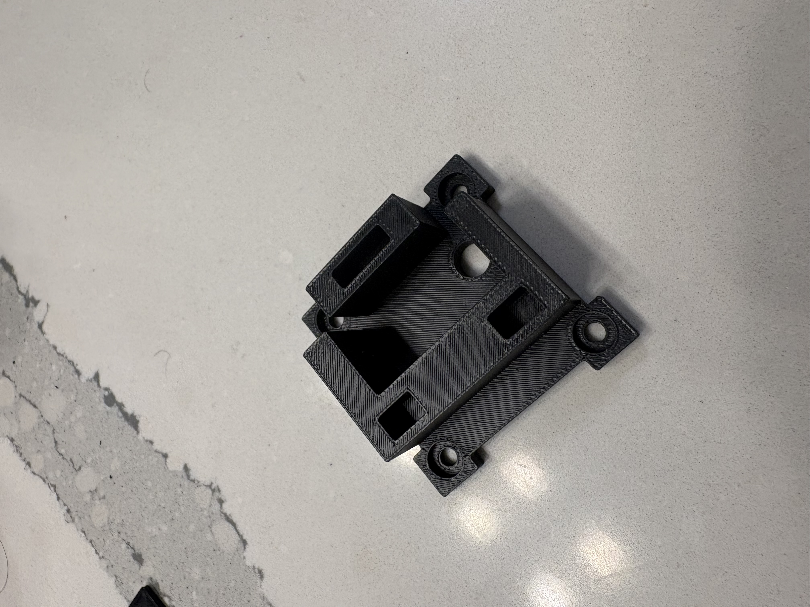 |
| **Base Revision 2** | [`Full_Base_V2.stl`](./Full_Base_V2.stl) | 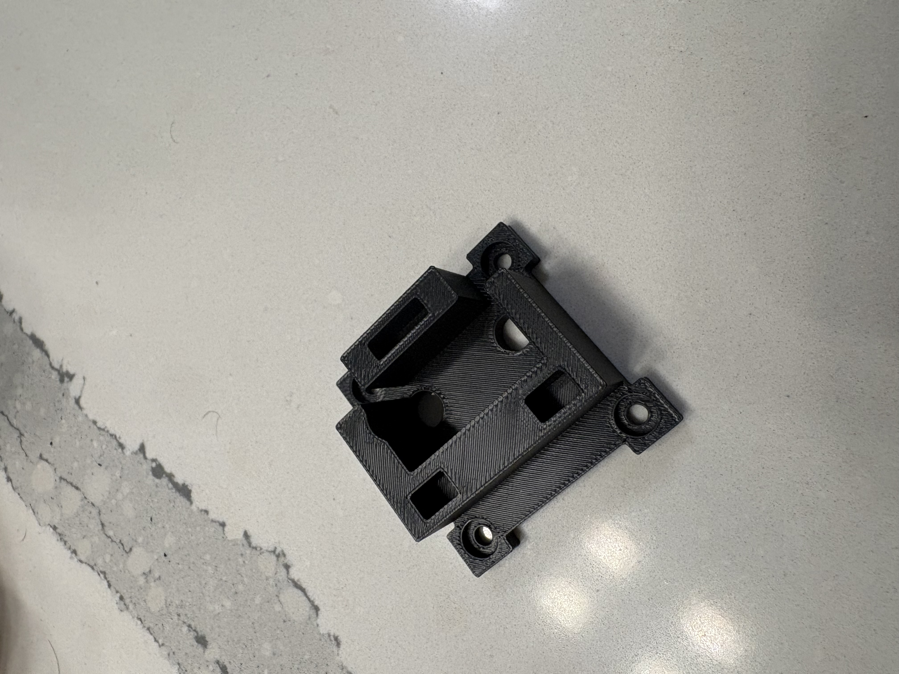 |
| **Failed Test Print** | [`Base-Top-Failed.jpeg`](./Base-Top-Failed.jpeg) | 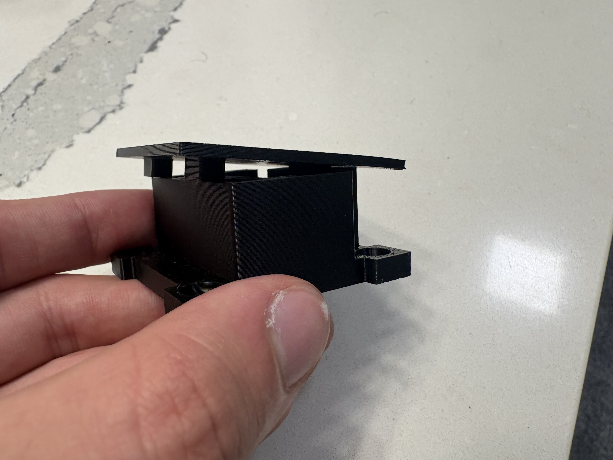 |

---

### 1.3 Assembled Final Product

The finalized enclosure deployed directly onto the laboratory optomechanical bench assembly.

| Top View (Cover On) | Internal Layout (Untopped) | In-Lab Operation |
| :---: | :---: | :---: |
| 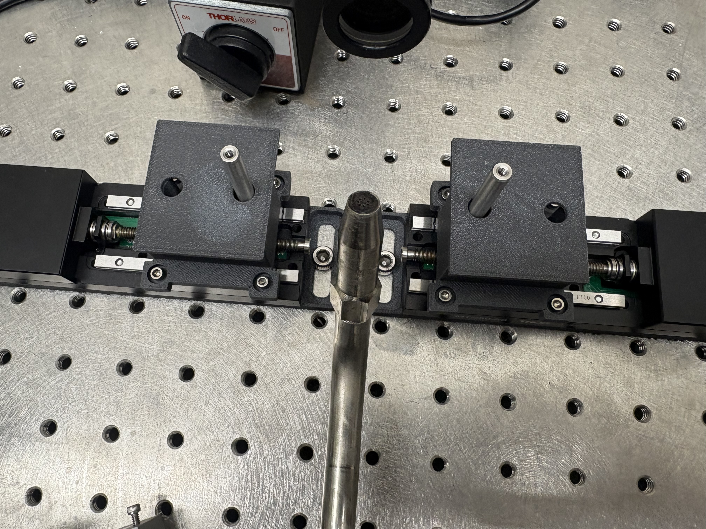 | 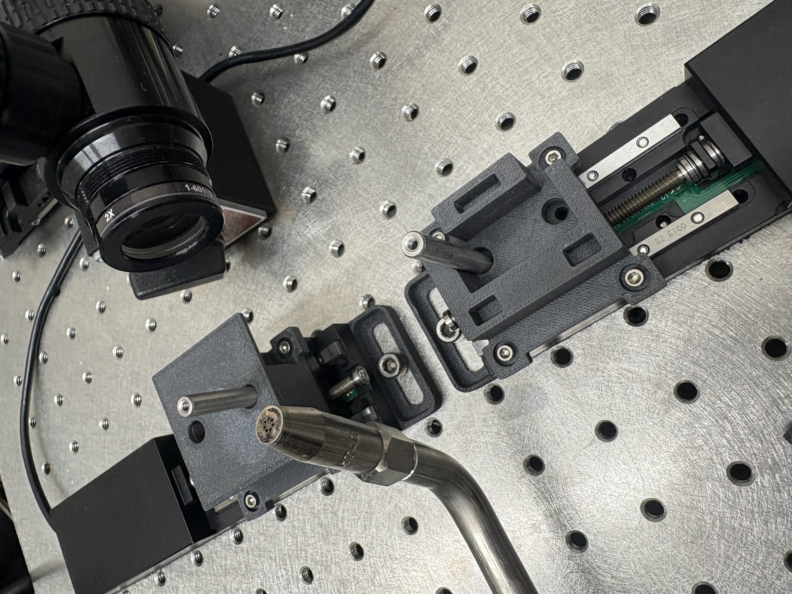 | 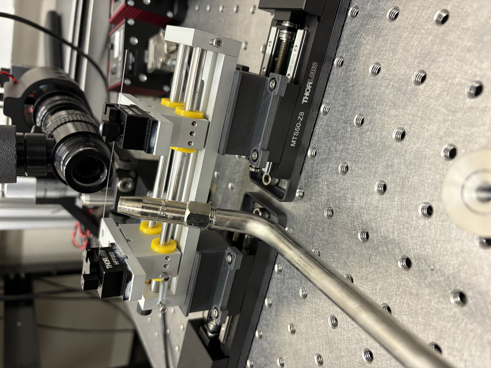 |

---

# 2. Integrated Lab Control & Vision System GUI
A full-stack, web-based instrument control system designed for the MTSU Quantum Optics Lab. The application consolidates dual-axis motor stage control, live microscope camera streaming, and real-time optical fiber measurement tools into a single unified interface.

---

### 2.1 Hardware Architecture & System Goals

* **Primary Objective:** Unify separate hardware peripherals (motor controllers and high-resolution camera feed) into one cohesive, browser-accessible dashboard.
* **Core Functionality:** Enable real-time motor stage translation, synchronized sequence routines, live video feed observation, image capture, and calibrated spatial measurements in micrometers ($\mu\text{m}$).

| System Goals | Integrated Hardware Peripherals |
| :--- | :--- |
| • **Simplified Motor Control:** Centralized axis position monitoring, homing, and safety stops. | • **2x Thorlabs Motor Controllers** (KDC101 Servo Controllers) |
| • **Unified Interface:** Integrated live camera streaming alongside dual-axis translation controls. | • **2x Thorlabs Translation Stages** |
| • **Preset Camera Control:** Adjustable exposure, gain, auto-scaling, and resolution controls. | • **1x Pixelink Industrial Camera** |
| • **In-Situ Measurement:** Direct pixel-to-micrometer dimensional measurement overlay. | • **1x Optical Microscope Assembly** |

---

### 2.2 System Architecture & Logic Map

The application follows a full-stack architecture with an asynchronous HTTP API layer linking the client dashboard to hardware-driver Python scripts.

| System Logic & Software Flow |
| :---: |
| 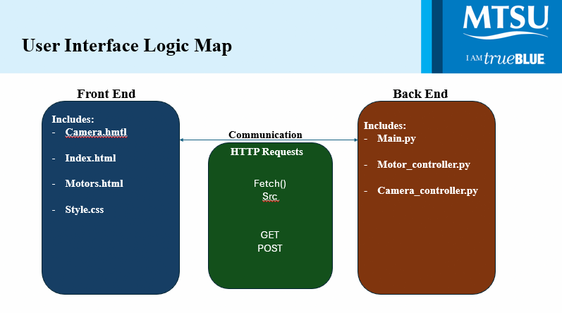 |
| *Frontend-to-backend communication architecture via HTTP GET/POST requests* |

#### Technical Stack Breakdown:
* **Front End:** HTML5, CSS3, JavaScript (Fetch API for asynchronous `GET`/`POST` requests, responsive canvas overlays for measurement calculations).
* **Back End:** Python (RESTful API hosting via `main.py`), controlling physical devices through submodules (`motor_controller.py` and `camera_controller.py`).
* **Communication Protocols:** JSON payload response handling for real-time motor telemetry (positioning, idle status) and live video streaming.

---

### 2.3 System Layout & Hardware Deployment

The entire system runs on a dedicated laboratory laptop, providing direct USB interface lines to all optomechanical components mounted on the optical table.

| Presentation View | Physical Laboratory Setup |
| :---: | :---: |
| 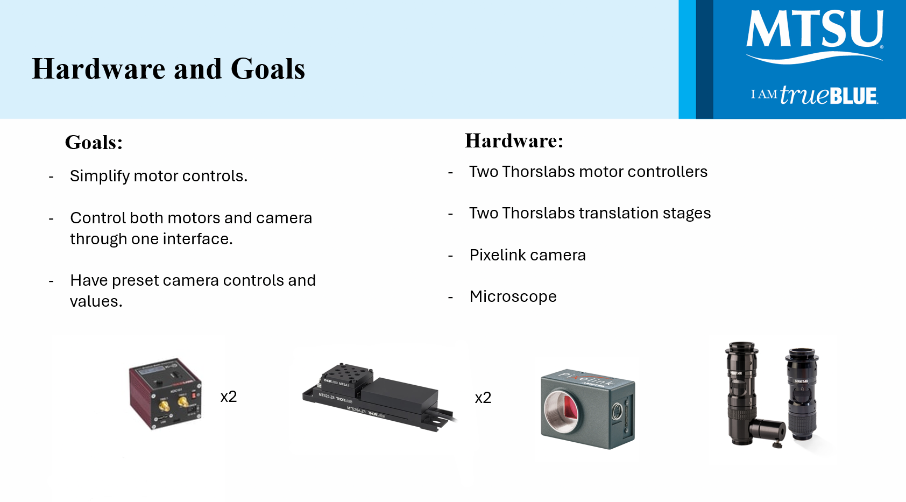 | 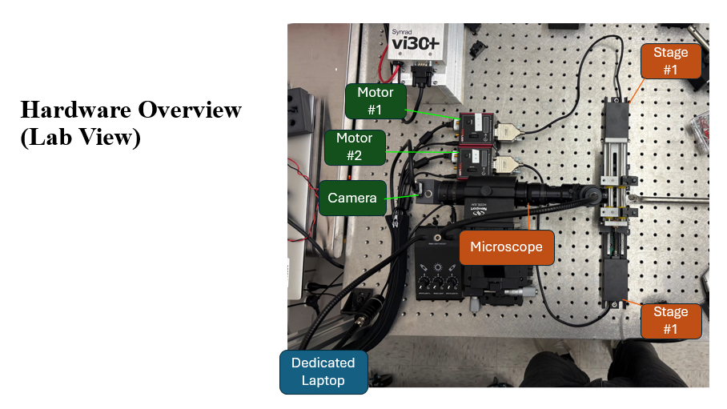 |

---

### 2.4 User Interface & Operational Control

#### 1. Main Control Dashboard (`index.html`)
Consolidates motor operations and vision streaming into a single view for active experimentation.

| Dashboard Overview | Key Dashboard Features |
| :---: | :--- |
| 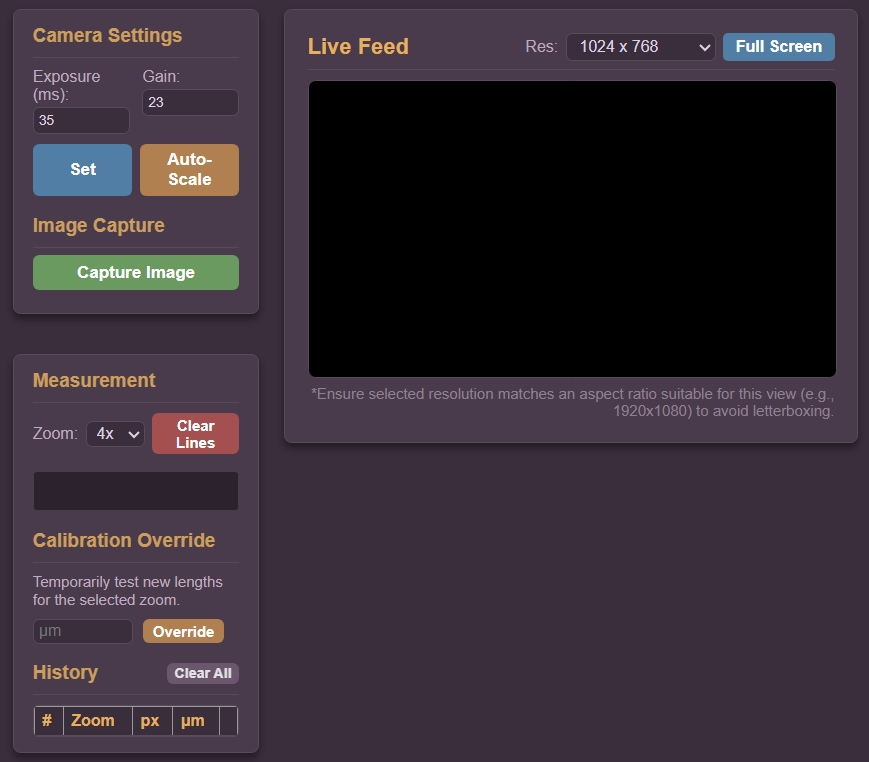 | • **Dual Motor Monitoring:** Live position readout ($mm$) and status tracking (Idle / Active). • **Independent Axis Actions:** Homing, pausing, resuming, and stopping per motor. • **Global Safety Controls:** One-click `Pause Both`, `Resume Both`, and emergency `Stop Both`. • **Automated Sequences:** Dropdown selector to execute synchronized multi-axis movement routines. • **Quick Capture:** Instant single-frame optical capture directly from the main view. |

---

#### 2. Detailed Motor Control View (`motors.html`)
Dedicated view for granular dual-axis stage configuration, step control, and sequence selection.

| Motor Control Interface | Key Capabilities |
| :---: | :--- |
| 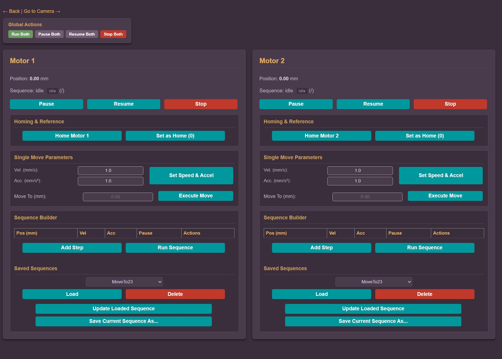 | • **Axis Specific Readouts:** Individual telemetry windows for Stage 1 and Stage 2. • **Manual & Step Moves:** Direct step-size configuration for precision alignment. • **Independent Axis Safety:** Individual Home, Pause, Resume, and Stop toggles per motor driver. • **Routine Automation:** Direct access to automated drawing and translation scripts. |

---

#### 3. Specialized Camera & Dimensional Measurement View (`camera.html`)
Dedicated view for fine alignment, sensor parameter tuning, and in-situ micro-scale measurement.

| Camera & Measurement Suite | Features & Capabilities |
| :---: | :--- |
| 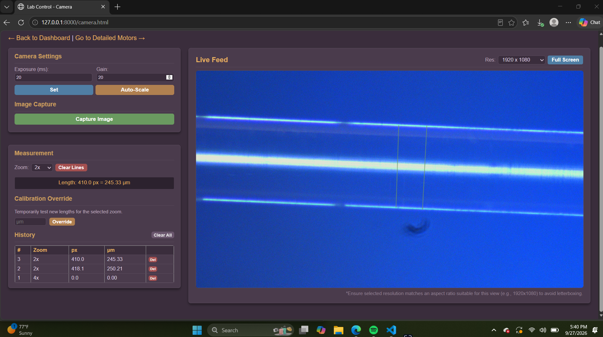 | • **Camera Parameter Tuning:** Manual entry for Exposure ($ms$) and Gain, alongside one-click Auto-Scale. • **Resolution Control:** Selectable aspect ratios up to $1920 \times 1080$. • **Micrometer Calibration Overlay:** Interactive line-drawing tool converts pixel distance ($px$) directly to micro-scale length ($\mu\text{m}$) based on selected microscope zoom magnification ($1\text{x}, 2\text{x}, 4\text{x}$). • **Measurement Log & Calibration Override:** Real-time history table keeping track of measured fiber dimensions with quick deletion and manual calibration test overrides. |

---

### 2.5 Software Repository & Source Files

Click any file below to view the source code directly in this repository:

#### **Back End (Python Server & Controllers)**
* 🐍 **[main.py](./main.py)** – Server entry point, API route management (`GET`/`POST`), and initialization routines.
* 🐍 **[motor_controller.py](./motor_controller.py)** – Driver interface translating API commands into Thorlabs motor translation movement.
* 🐍 **[camera_controller.py](./camera_controller.py)** – Pixelink camera SDK wrapper for frame capture, exposure adjustments, and video feed serving.

#### **Front End (User Interface)**
* 📄 **[index.html](./index.html)** – Main laboratory dashboard layout.
* 📄 **[camera.html](./camera.html)** – Dedicated live video feed, camera settings, and line-measurement interface.
* 📄 **[motors.html](./motors.html)** – Detailed standalone motor stage configuration page.
* 🎨 **[style.css](./style.css)** – UI styling, dark mode theme, and responsive panel layouts.

---

### 2.6 Summary & Key Accomplishments

* **Integrated Workflow:** Replaced separate, single-purpose vendor software utilities with a lightweight, browser-based control hub.
* **In-Situ Metrology:** Added pixel-calibrated measurement overlays, allowing researchers to measure fiber tapers directly inside the live camera feed without exporting images to external software.
* **Synchronized Automation:** Enabled multi-axis automated movement sequences managed through backend Python routines for repeatable fiber-drawing procedures.
